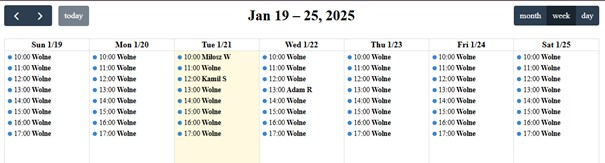
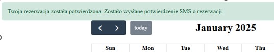
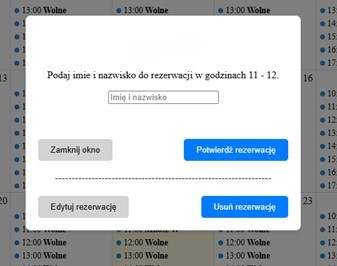

# ReservationCalendar

A restaurant table reservation calendar system. The application consists of a server-side backend built with **Node.js** and a client-side **Angular** frontend interface.

## ✨ Key Features

The application implements the following functionality:

### 📅 Calendar Display
*   **Clear Visualization:** Presents a transparent list of days, weeks, or months.
*   **Switchable Views:** Users can toggle between Day, Week, and Month views.
*   **Availability Status:** Clearly distinguishes between free and busy time slots.
*   **Navigation:** Allows easy navigation to the previous/next month and returning to the current day.



### 📝 Appointment Booking
*   **Slot Selection:** Users can select a specific time slot to add it to the calendar.
*   **Data Collection:** Captures essential details during booking (e.g., First Name, Last Name, Email).
*   **Conflict Prevention:** The system validates slot availability before confirming any reservation.
*   **SMS Notifications:** Upon successful booking, an automatic SMS confirmation is sent to the user.



### ⚙️ Reservation Management
*   **Real-Time Updates:** Once a reservation is made, the slot status updates instantly from "Free" to "Reserved".
*   **Automatic Cleanup:** The system automatically cleans up old events upon application startup.
*   **Mock Data:** When the backend starts, the database is populated with mock events to facilitate testing and demonstration.

### 👥 Admin Functions
*   **Full Access:** Administrators can view the complete list of all reservations.
*   **Reservation Editing:** Capability to modify existing reservations, including changing client details. After editing, the new user receives an SMS notification.
*   **Reservation Cancellation:** Administrators can cancel any reservation. The user whose reservation is cancelled is informed via an SMS notification.



## 🚀 Technologies

The project utilizes the following technology stack:

### Frontend
*   **Angular** (v18.1.4)
*   **Angular Material** – UI component library
*   **FullCalendar** – Interactive calendar display
*   **RxJS** – Reactive extensions for handling asynchronous operations
*   **TypeScript**

### Backend
*   **Node.js**
*   **Express.js** – Server framework
*   **Sequelize** – ORM for database management
*   **SQLite** – Database (file-based, stored in `./Backend/storage/data.db`)

## 🛠️ Prerequisites

To run this project locally, ensure you have the following installed:
*   [Node.js](https://nodejs.org/) (LTS version recommended)
*   [Angular CLI](https://angular.dev/tools/cli) (install globally via: `npm install -g @angular/cli`)

## ⚙️ Installation and Setup

The project is divided into two independent directories: `Frontend` and `Backend`. You need to run them in separate terminals.

### 1. Setting up the Backend

The backend handles business logic and communication with the SQLite database.

1.  Navigate to the backend directory:
    ```bash
    cd Backend
    ```
2.  Install dependencies:
    ```bash
    npm install
    ```
3.  Start the server:
    ```bash
    node app.js
    ```
    The server will start on port **3000** (`http://localhost:3000`) by default.
    > **Note:** Upon startup, the application synchronizes the database (`sequelize.sync()`) and may clean up old events (as defined in the `app.js` logic).

### 2. Setting up the Frontend

The user interface for managing the calendar.

1.  Open a new terminal and navigate to the frontend directory:
    ```bash
    cd Frontend
    ```
2.  Install dependencies:
    ```bash
    npm install
    ```
3.  Start the development server:
    ```bash
    ng serve
    ```
4.  Open your browser and navigate to:
    `http://localhost:4200/`

## 📂 Project Structure

*   `/Backend` – API server source code (Node.js + Express).
    *   `app.js` – Main server entry point.
    *   `db.js` – SQLite database connection configuration.
    *   `/events` – Event handling logic (controllers, models).
*   `/Frontend` – Client application source code (Angular).
    *   `/src/app` – Components and calendar view logic.

